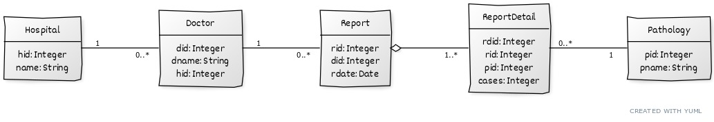

# Pathology cases reports

## Datos

Se provee un archivo "Pathologies.csv", que representa un extracto de reportes de casos
de patologías por parte de médicos de distintos centros de salud, según detalle:

- **DID (INT)**: identificador del médico (doctor) que presenta el reporte de casos.
- **DNAME (TEXT)**: nombre del médico (doctor) que presenta el reporte de casos.
- **HID (INT)**: identificador del centro de salud (hospital) al que pertenece el médico.
- **HNAME (TEXT)**: nombre del centro de salud (hospital) al que pertenece el médico.
- **RID (INT)**: identificador del reporte de casos.
- **RDATE (DATE)**: fecha del reporte de casos.
- **RDID (INT)**: identificador del item (detail) del reporte de casos.
- **PID (INT)**: identificador de la patología reportada en el ítem.
- **PNAME (TEXT)**: nombre de la patología reportada en el ítem.
- **CASES (INT)**: cantidad de casos asociados a la patología reportada en el ítem.

A partir de los datos mencionados, usted debe importar estos a un modelo de objetos en memoria
que debería responder al siguiente diagrama de clases:

## Estrategias

Dado que será requerimiento posterior crear una base de datos a partir del modelo de objetos,
**con la finalidad de realizar consultas varias**, usted puede:

- Crear el modelo de objetos directamente como Entities, y utilizar las mismas tanto para la
carga de la base de datos como para las consultas posteriores.
- Crear un modelo temporal simplificado (pojos / records), utilizarlo para la carga de la base
mediante native queries, y luego crear el modelo definitivo de entities para las consultas.

>**NOTA**: en ambos casos, cada objeto asociado al modelo debe existir una y **sólo una** vez en memoria.

## Base de datos

Usted puede organizar la estructura de la base de datos según crea pertinente, teniendo en
cuenta que las tablas deben representar el modelo de objetos y que todos los datos importados
deben estar cargados y accesibles en la base de datos.

Se provee estructura sugerida en el archivo "Pathologies.sql".

## Consultas

Usted puede optar en resolver los requerimientos solicitados utilizando, según el caso:
- Consultas puramente
- Consultas + código (preferente utilizando streams/functional)

## Se pide (impresión por pantalla):

- **1) Detalle de casos para un centro de salud (hospital) determinado**:
  - Cabecera con id y nombre del centro de salud
  - Ciclo (por cada médico)
    - Id, nombre, total de casos
  - Total centro de salud
- **2) Detalle de patologías para un médico determinado**:
  - Cabecera con id y nombre del médico
  - Ciclo (por cada reporte)
    - Id y fecha del reporte
    - Ciclo (por cada patología)
      - Id, nombre, cantidad de casos
    - Total reporte (al final de cada reporte)
  - Total médico
- **3) Detalle de casos para una patología y rango de fechas determinados**:
  - Cabecera con id y nombre de patología, y rango de fechas (desde/hasta)
  - Ciclo (por cada centro de salud):
    - Id y nombre de centro
    - Ciclo (por cada reporte):
      - Fecha y cantidad de Casos
    - Total centro de salud
  - Total casos

    